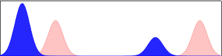

This toolbox is a basic implementation of Sinkhorn-like algorithms to solve for OT-related problems.

The computational methods and relevant bibliography can be found in:

L. Chizat, G. Peyre, B. Schmitzer, F-X. Vialard. _[Unbalanced optimal transport: Geometry and Kantorovich formulation](ttp://arxiv.org/abs/1607.05816)_. Preprint Arxiv:1508.05216, 2016.

Comparison of balanced vs. unbalanced interpolation computed using barycenters with varying weights:

The unbalanced interpolation is able to correctly interpolate between the modes of distribution by introducing mass creation/destruction during the interpolation.

Main features
-----

This toolbox implements log-domain computations, so it is always stable, even for small values of `epsilon`. It implements both balanced (exact marginal constraints) and unbalanced transport (relaxed marginal constraints). It uses a heavy-ball-like extrapolation to speed-up convergence.

Computational functions
-------

- `sinkhorn_log.m`: computation of OT couplings between two distributions.
- `barycenter_log.m`: computation of OT barycenters between two or more distributions.

Parameters
-------

The main parameters are:
- `epsilon` is the entropic regularization strength. Increasing speeds-up the convergence but leads to blurrier results.
- `options.rho` controls balanced (`tau=Inf`) vs unbalanced (`0<tau<Inf`) trade-off.
- `options.tau` introduces extrapolation acceleration (`tau=0` means no extrapolation, `-1<tau<0` means extrapolation).

Scripts
-------

- `test_sinkhorn.m`
- `test_barycenters.m`: test the computation of barycenters between two distributions, and compares in particular the balanced to the unbalanced cases.

Copyright
-------

Copyright (c) 2017 Gabriel Peyré
